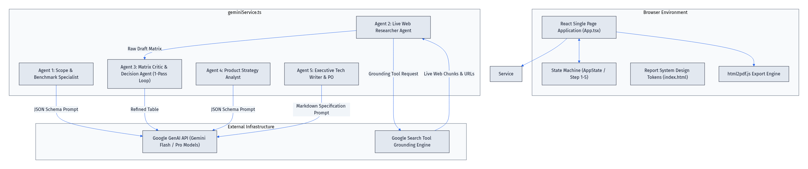
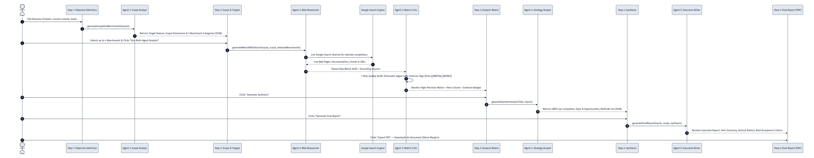
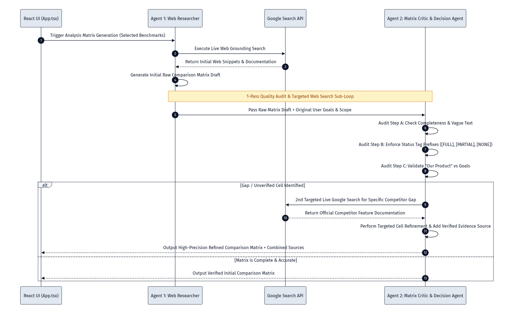

# Cloud Services AI Suite

> **Enterprise Intelligence Portal & Multi-Agent Acceleration Suite**  
> *Transform strategic engineering pillars into actionable frameworks, live web-grounded competitive benchmark matrices, strategic SWOT syntheses, and executive recommendation reports.*

[](https://github.com/mateuslcn/cloud-services-ai-suite)
[](./Benchmarking_Accelerator_Documentation.docx)
[](#license)

---

## Executive Summary

The **Cloud Services AI Suite** is an enterprise-grade performance portal designed for modern engineering organizations. It unifies 5 core strategic pillars into a cohesive operational intelligence platform:

1. **Quality**: Shifting Left to Target Zero Escaped Defects.
2. **Productivity**: Scaling Output with AI-Assisted Engineering.
3. **Cycle Time**: Driving Delivery Velocity and Agility.
4. **Innovation**: Fostering Engineering-Led Feature Ideation.
5. **Competitiveness**: Outpacing the Market (*Powered by the **Benchmarking Acceleration Engine***).

Driven by an orchestrated **Multi-Agent System (MAS)** equipped with **Live Google Search Grounding** and an automated **1-Pass Quality Critic Review Loop**, the platform turns high-level product objectives into fully validated feature comparison matrices, SWOT syntheses, MoSCoW feature prioritizations, and formal Product Owner specifications with exportable `.docx` reports.

---

## 5 Strategic Pillars

```
+---------------------------------------------------------------------------------------------------+
|                                      CLOUD SERVICES AI SUITE                                      |
+------------------+-------------------+--------------------+------------------+--------------------+
| 🛡️ Quality       | 📈 Productivity   | ⏱️ Cycle Time      | 💡 Innovation    | ⚡ Competitiveness |
| Target Zero      | AI-Assisted       | Delivery Velocity  | Engineering-Led  | Outpacing Market   |
| Escaped Defects  | Engineering       | & Agility          | Ideation         | Benchmarking Engine|
+------------------+-------------------+--------------------+------------------+--------------------+
```

* **Quality**: Focuses on auditing defects across component and platform tests to eliminate customer-found escaped defects using AI-driven automated testing.
* **Productivity**: Integrates AI tools into daily coding, debugging, testing, and documentation to scale feature velocity.
* **Cycle Time**: Drastically reduces time-to-market across feature delivery, platform upgrades, and test execution.
* **Innovation**: Empowers engineering-led ideation to prototype and inject monetizable features directly into product roadmaps.
* **Competitiveness (Active Engine)**: Executes live web-grounded multi-agent benchmarking against industry leaders.

---

## Key Capabilities & Features

* **Off-Canvas Navigation Panel**: Clean, drawer-based navigation panel (`☰`) that opens seamlessly over the enterprise portal.
* **5-Step Benchmarking Workflow**: Guides product managers through Objective Definition, Scope & Target Selection, Evidence-Grounded Matrix Analysis, Strategic Synthesis, and Executive Report Generation.
* **Orchestrated 5-Agent Architecture**: Five specialized AI agents collaborate across prompt schemas, live web grounding, quality audits, and technical document writing.
* **Live Web Evidence Mining**: Real-time Google Search integration fetches official competitor documentation, feature releases, and live web evidence.
* **1-Pass Critic & Decision Loop**: Agent 3 audits Agent 2's initial matrix draft. If any unverified cell or competitor gap is detected, Agent 3 executes a 2nd targeted Google Search to refine capabilities before finalizing the matrix.
* **Full Report & DOCX Export**: Generates client-side Word `.docx` documents containing complete Analysis Matrices, SWOT syntheses, rollout roadmaps, and user stories.
* **Expanded Gemini Model Dropdown**: Full support for Google AI Studio models including `gemini-3.6-flash`, `gemini-3.5-pro`, `gemini-2.5-flash`, `gemini-2.0-flash`, and `gemini-1.5-pro`.

---

## System Architecture & Multi-Agent Pipeline



### The 5 Agent Roles

| Agent | Skill Name | Function | Responsibility |
|---|---|---|---|
| **Agent 1** | *Scope & Benchmark Specialist* | `generateScopeAndBenchmarks` | Analyzes business goals, outputting a 5-dimension analysis scope and 3 benchmark categories (Direct, Market, Adjacent). |
| **Agent 2** | *Live Web Researcher Agent* | `generateMatrixWithSearch` | Executes live Google Search grounding queries for selected competitors to mine real-time evidence and feature documentation. |
| **Agent 3** | *Matrix Critic & Decision Agent* | `reviewAndRefineMatrix` | Performs a 1-pass quality audit on the raw matrix. Executes a **2nd targeted Google Search** when gaps/uncertainties are found to ensure 100% status tag compliance (`[FULL]`, `[PARTIAL]`, `[NONE]`). |
| **Agent 4** | *Product Strategy Analyst* | `generateSynthesis` | Synthesizes matrix findings into competitor SWOT analysis, product gaps & opportunities, and MoSCoW feature prioritization. |
| **Agent 5** | *Executive Tech Writer & PO* | `generateFinalReport` | Generates the Executive Recommendation Report, vertical rollout roadmap, and user stories with bolded **Acceptance Criteria**. |

---

## Multi-Agent Workflow Sequence



---

## 1-Pass Critic Review & Refinement Sub-Loop



---

## Tech Stack & Structure

* **Frontend**: React 18, TypeScript, Tailwind CSS, Lucide React Icons, React Markdown (Remark GFM).
* **AI & Grounding Engine**: `@google/genai` (Gemini 3.6 / 3.5 / 2.5 / 2.0) with Google Search Tool Grounding.
* **Document Exporter**: `docx` package for client-side Word document creation.
* **Single-File Bundler**: `vite-plugin-singlefile` (compiles entire app into a self-contained `index.html` / `Index.html`).

```
cloud-services-ai-suite/
├── index.html                                 # Compiled Single-File Production Bundle
├── Index.html                                 # Single-File Production Entry
├── README.md                                  # Project Documentation
├── 1_System_Architecture_Overview.png          # High-Res Architecture Diagram
├── 2_Multi_Agent_Sequence_Workflow.png        # High-Res Sequence Diagram
├── 3_One_Pass_Review_Loop_Sequence.png        # High-Res Critic Review Diagram
├── Benchmarking_Accelerator_Documentation.docx# Full System Documentation (Word)
├── Benchmarking_Accelerator_User_Manual.docx  # User Operations Manual (Word)
├── skills/                                    # Individual Agent Skill Markdown Specifications
│   ├── agent_1_scope_analyst.md               # Agent 1 Skill Specification
│   ├── agent_2_live_web_researcher.md         # Agent 2 Skill Specification
│   ├── agent_3_matrix_critic.md               # Agent 3 Skill Specification
│   ├── agent_4_product_strategy_analyst.md    # Agent 4 Skill Specification
│   └── agent_5_executive_tech_writer.md       # Agent 5 Skill Specification
└── frontend/
    ├── App.tsx                                # Main Portal & Benchmarking UI
    ├── components/
    │   └── StepIndicator.tsx                  # 5-Step Navigation Header
    ├── services/
    │   └── geminiService.ts                   # 5 Agent Skills & Google Search API Calls
    ├── utils/
    │   └── docxExporter.ts                    # Word .docx Exporter Utility
    └── types.ts                               # App State & Schema Interfaces
```

---

## Quick Start & Local Setup

### Prerequisites
* **Node.js**: v18.0.0 or higher
* **Google AI Studio API Key**: Get a free key at [Google AI Studio](https://aistudio.google.com/)

### Installation

1. **Clone the Repository**:
   ```bash
   git clone https://github.com/mateuslcn/cloud-services-ai-suite.git
   cd cloud-services-ai-suite
   ```

2. **Install Dependencies**:
   ```bash
   npm install --prefix frontend
   ```

3. **Run Development Server**:
   ```bash
   npm run dev --prefix frontend
   ```
   Open `http://localhost:5173` in your browser.

4. **Build Production Bundle**:
   ```bash
   npm run build-single
   ```

---

## Deployment Guide

### Vercel (Recommended)

1. Connect your GitHub account to **[Vercel](https://vercel.com/)**.
2. Select **`mateuslcn/cloud-services-ai-suite`**.
3. Set **Framework Preset**: `Vite` (or `Other` with root directory `./`).
4. Click **Deploy**.

---

## License

Distributed under the MIT License. See `LICENSE` for details.
