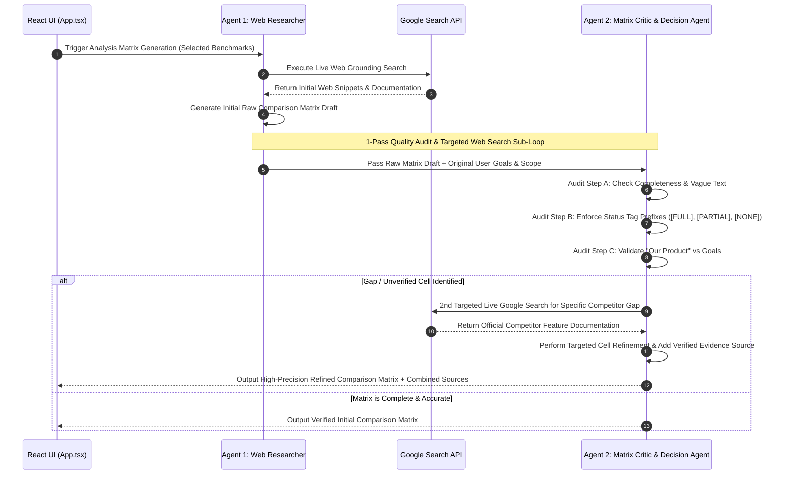

# 🚀 Benchmarking Accelerator

> **AI-Powered Multi-Agent Competitive Analysis & Feature Specification Engine**  
> *Transform business objectives into live web-grounded benchmark matrices, strategic SWOT syntheses, and executive recommendation reports with actionable user stories.*

[](https://mateuslcn.github.io/benchmarking-accelerator/)
[](./Benchmarking_Accelerator_Documentation.docx)
[](#license)

---

## 📌 Executive Summary

The **Benchmarking Accelerator** is an enterprise-grade web application designed to eliminate manual competitive research overhead. Driven by an orchestrated **Multi-Agent System (MAS)** equipped with **Live Google Search Grounding** and an automated **1-Pass Quality Critic Review Loop**, the platform turns high-level product goals into fully validated feature comparison matrices and formal Product Owner specifications.

---

## 🌟 Key Capabilities & Features

* **⚡ 5-Step Streamlined Workflow**: Guides users seamlessly from Objective Definition to Scope Selection, Evidence-Grounded Matrix Analysis, Strategic Synthesis, and Executive Report Generation.
* **🤖 Orchestrated 5-Agent Architecture**: Five specialized AI agents collaborate across prompt schemas, live web grounding, quality audits, and technical document writing.
* **🔍 Live Web Evidence Mining**: Real-time Google Search integration fetches official competitor documentation, feature releases, and live web evidence.
* **⚖️ 1-Pass Critic & Decision Loop (2nd Search Refinement)**: Agent 3 audits Agent 2's initial matrix draft. If any unverified cell or competitor gap is detected, Agent 3 executes a 2nd targeted Google Search to refine capabilities before finalizing the matrix.
* **🛡️ Client-Side Direct Execution & Privacy-First**: Operates using the user's browser-entered Google AI Studio API key stored exclusively in local `localStorage`. Zero account data or telemetry stored on external servers.
* **📊 Report System Design Specification**: Exports executive reports with A4 PDF export (20mm margins), Hero summary cards, MoSCoW color icons (🔴 🟡 🔵 ⚪), vertical rollout plans, and bolded **Acceptance Criteria**.

---

## 🏗️ System Architecture & Multi-Agent Pipeline

```mermaid
graph TD
    subgraph Client Layer [Browser Environment]
        UI["React Single Page Application (App.tsx)"]
        State["State Machine (AppState / Step 1-5)"]
        CSS["Report System Design Tokens (index.html)"]
        Export["PDF Export Engine (html2pdf.js)"]
    end

    subgraph Service & AI Agent Layer [geminiService.ts]
        A1["Agent 1: Scope & Benchmark Specialist"]
        A2["Agent 2: Live Web Researcher Agent"]
        A3["Agent 3: Matrix Critic & Decision Agent (1-Pass Loop + 2nd Search)"]
        A4["Agent 4: Product Strategy Analyst"]
        A5["Agent 5: Executive Tech Writer & PO"]
    end

    subgraph External Infrastructure
        GeminiAPI["Google GenAI API (Gemini Flash / Pro Models)"]
        GoogleSearch["Google Search Tool Grounding Engine"]
    end

    UI <--> State
    UI --> Service Layer
    A1 -->|JSON Schema Prompt| GeminiAPI
    A2 -->|Grounding Tool Request| GoogleSearch
    GoogleSearch -->|Live Web Chunks & URLs| A2
    A2 -->|Raw Draft Matrix| A3
    A3 -->|Targeted Search Request| GoogleSearch
    GoogleSearch -->|Refined Evidence| A3
    A3 -->|Audited Table| GeminiAPI
    A4 -->|JSON Schema Prompt| GeminiAPI
    A5 -->|Markdown Specification Prompt| GeminiAPI
    UI --> Export
```

### 🤖 The 5 Agent Roles

| Agent | Skill Name | Function | Responsibility |
|---|---|---|---|
| **Agent 1** | *Scope & Benchmark Specialist* | `generateScopeAndBenchmarks` | Analyzes business goals, outputting a 5-dimension analysis scope and 3 benchmark categories (Direct, Market, Adjacent). |
| **Agent 2** | *Live Web Researcher Agent* | `generateMatrixWithSearch` | Executes live Google Search grounding queries for selected competitors to mine real-time evidence and feature documentation. |
| **Agent 3** | *Matrix Critic & Decision Agent* | `reviewAndRefineMatrix` | Performs a 1-pass quality audit on the raw matrix. Executes a **2nd targeted Google Search** when gaps/uncertainties are found to ensure 100% status tag compliance (`[FULL]`, `[PARTIAL]`, `[NONE]`). |
| **Agent 4** | *Product Strategy Analyst* | `generateSynthesis` | Synthesizes matrix findings into competitor SWOT analysis, product gaps & opportunities, and MoSCoW feature prioritization. |
| **Agent 5** | *Executive Tech Writer & PO* | `generateFinalReport` | Generates the Executive Recommendation Report, vertical rollout roadmap, and user stories with bolded **Acceptance Criteria**. |

---

## 🔄 1-Pass Critic Review & Refinement Sub-Loop



---

## 🎨 Report System Design Specification

Reports generated by **Agent 5** adhere strictly to the formal **Report System Specification**:

1. **Executive Summary Hero Card**: Single blockquote container (`> Executive Summary: ...`) with `#F8FAFC` background and `#0F172A` left border.
2. **Key Gaps & Strategic Opportunities**: Subsection items formatted with **Bold Title Prefixes** (`**Title Prefix:** Description`).
3. **Prioritized Feature Matrix**: Markdown table with `#0F172A` dark navy header, white bold text, and direct color icons:
   * 🔴 **Must Have**
   * 🟡 **Should Have**
   * 🔵 **Could Have**
   * ⚪ **Won't Have**
4. **Phased Rollout Plan**: Strictly vertical sequential list by Phase and Sprint.
5. **Actionable User Stories**: Structured with **As an**, **I want to**, **So that**, **MoSCoW Priority:**, and bolded **Acceptance Criteria:**.

---

## 💻 Tech Stack & Structure

* **Frontend**: React 18, TypeScript, Tailwind CSS, Lucide React Icons, React Markdown (Remark GFM).
* **AI & Grounding Engine**: `@google/genai` (Gemini 2.5 Flash / Gemini Pro) with Google Search Tool Grounding.
* **Export Engine**: `html2pdf.js` (A4 format with 20mm margins).
* **Single-File Bundler**: `vite-plugin-singlefile` (compiles entire app into a self-contained `Index.html`).

```
benchmarking-accelerator/
├── Index.html                                 # Compiled Single-File Production Bundle
├── README.md                                  # Project Documentation
├── 1_System_Architecture_Overview.png          # High-Res Architecture Diagram
├── 2_Multi_Agent_Sequence_Workflow.png        # High-Res Sequence Diagram
├── 3_One_Pass_Review_Loop_Sequence.png        # High-Res Critic Review Diagram
├── Benchmarking_Accelerator_Documentation.docx# Full System Documentation (Word)
└── frontend/
    ├── App.tsx                                # Main React State Machine & UI
    ├── components/
    │   └── StepIndicator.tsx                  # 5-Step Navigation Header
    ├── services/
    │   └── geminiService.ts                   # 5 Agent Skills & Google Search API Calls
    ├── utils/
    │   └── docxExporter.ts                    # DOCX Exporter Utility
    ├── types.ts                               # App State & Schema Interfaces
    └── index.html                             # Report Design System CSS Variables
```

---

## 🚀 Quick Start & Local Setup

### Prerequisites
* **Node.js**: v18.0.0 or higher
* **Google AI Studio API Key**: Get a free key at [Google AI Studio](https://aistudio.google.com/)

### Installation

1. **Clone the Repository**:
   ```bash
   git clone https://github.com/mateuslcn/benchmarking-accelerator.git
   cd benchmarking-accelerator
   ```

2. **Install Dependencies**:
   ```bash
   npm install --prefix frontend
   ```

3. **Run Development Server**:
   ```bash
   npm run dev --prefix frontend
   ```
   Open `http://localhost:5173` in your browser.

4. **Build Production Bundle**:
   ```bash
   npm run build-single
   ```

---

## 🌐 Deployment Guide

### GitHub Pages (Recommended)

1. Navigate to **[Repository Settings -> Pages](https://github.com/mateuslcn/benchmarking-accelerator/settings/pages)**.
2. Under **Build and deployment -> Source**, select **`Deploy from a branch`**.
3. Set **Branch**: `main` and **Folder**: `/ (root)`.
4. Click **Save**. The live app will be published at:  
   👉 **`https://mateuslcn.github.io/benchmarking-accelerator/`**

---

## 📄 License

Distributed under the MIT License. See `LICENSE` for details.
